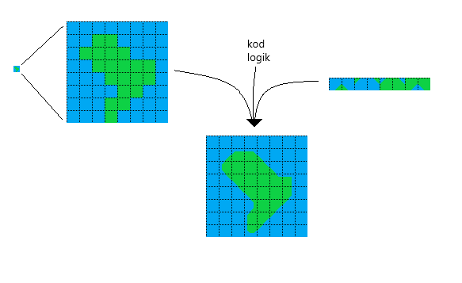

# Idéer

## Kartan

-   Kartan loopar horisontellt och är avgränsad med ismassor i norr och syd för att fungera som ett jordklot.
-   Rektangulär karta, runt 40k tiles bred?

## Tilemapping

-   Kartan sparas som en bmp (bitmap) för effektivitet, där varje pixel representerar en tile.
-   Algoritm används för att ersätta endast land- eller vatten-tiles till tiles med mjukare former.
-   Ca 32 tiles för land och vatten?
-   Ett build-steg där en oprocesserad bmp görs om till en med färdig tile-data?

